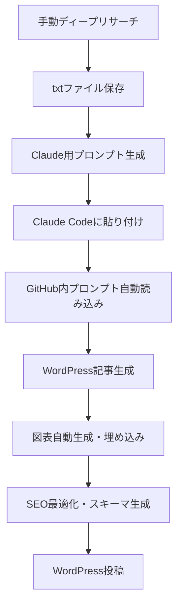

# 🤖 GPTリサーチ → Claude Code → WordPress自動投稿システム

**完全自動化**で高品質なWordPress記事を効率生成！複数記事構成対応

[](https://nodejs.org/)
[](https://opensource.org/licenses/MIT)
[](https://wordpress.org/)
[](https://claude.ai/code)

## 🚀 システム概要

GPTディープリサーチ + Claude Code + WordPress自動投稿の完全ワークフロー！
複数記事構成にも対応し、1回のリサーチで複数の下書き記事を自動生成できます。

### 🌟 主な特徴

- 🤖 **GPT→Claude連携** - GPTリサーチ結果をClaude Codeで高品質記事化
- 📚 **複数記事構成対応** - 1回のリサーチで複数記事を自動生成・保存
- 🔗 **完全自動化** - txtファイル保存からWordPress下書き保存まで全自動
- 💰 **コスト効率** - OpenAI API不要でClaude Codeの力を最大活用
- 🎯 **専用プロンプト** - GitHub内の最適化された3つのプロンプトを自動使用
- 🛡️ **安全設計** - 全て下書き保存で誤公開防止

## 🎯 完全自動化ワークフロー

### 1. GPTでディープリサーチ実施
GPTに詳細なリサーチプロンプトを送信し、包括的な調査結果を取得

### 2. リサーチ結果をtxtファイルに保存
```bash
inputs/manual_research/your_research.txt
```
GPTの回答をそのままコピペして保存

### 3. Claude用プロンプト自動生成
```bash
npm run claude your_research.txt
```
3つの専用プロンプト（記事生成・図表・スキーマ）を自動統合

### 4. Claude Codeで記事生成＆WordPress自動保存
```bash
# JSON記事の場合（従来の方法）
node src/wordpress_auto_post.js

# Markdown記事の場合（新機能）
npm run wordpress-upload-md
```
複数記事構成も自動検出→個別下書き保存

### 🆕 新機能：Markdownファイル直接アップロード
キーワード分析結果からMarkdown形式で記事を生成し、直接WordPressにアップロード可能：

```bash
# 1. キーワード分析結果を元にMarkdown記事を作成
# (outputsフォルダに.mdファイルを配置)

# 2. Markdown記事を一括アップロード
npm run wordpress-upload-md
```

## 📁 新しいプロジェクト構造

```
blog-prompt/
├── docs/
│   ├── prompts/                      # AIプロンプト集
│   │   ├── wordpress_article_generator.md
│   │   ├── chart_generator.md
│   │   └── schema_markup_generator.md
│   ├── SETUP.md                     # セットアップガイド
│   └── CHANGELOG.md                 # 変更履歴
├── src/
│   ├── claude_article_generator.js  # Claude Code連携システム
│   ├── index.js                     # 旧システム（互換性）
│   └── core/                        # コアモジュール
├── inputs/
│   └── manual_research/             # 手動リサーチtxtファイル
├── outputs/
│   └── claude_articles/             # Claude用プロンプト・データ
├── examples/
│   └── research_template.txt        # リサーチテンプレート
├── legacy/                          # 旧システムファイル
└── MANUAL_WORKFLOW.md              # 詳細ワークフロー説明
```

## ⚡ クイックスタート

### 1. 準備（環境変数設定不要！）

```bash
# リポジトリクローン
git clone https://github.com/Ezark213/blog-prompt.git
cd blog-prompt

# 依存関係インストール
npm install

# サンプルファイル作成
npm run claude-sample
```

### 2. 手動リサーチの実施

お好きな方法でキーワードについて調査：
- Google検索
- 専門サイト調査
- 競合分析
- 実務経験の整理

### 3. txtファイルに保存

```txt
# inputs/manual_research/freee_advanced.txt

freee会計ソフトの高度な活用法について

■ 自動仕訳ルールの設定
- 銀行連携での自動振り分け
- 定期取引の自動化
- 仕訳辞書機能の活用

■ 効率的な経理業務
- 月次決算の自動化
- レポート作成の効率化
- 税務申告書の自動作成

目標文字数: 5500文字で実務重視
```

### 4. Claude Code用プロンプト生成

```bash
# Claude用プロンプト生成
npm run claude freee_advanced.txt

# 生成されたプロンプトを確認
cat outputs/claude_articles/freee_advanced_claude_prompt.md
```

### 5. Claude Codeで記事生成

1. 生成されたプロンプトをコピー
2. Claude Codeに貼り付け
3. Claude CodeがGitHub内プロンプトを自動使用
4. 高品質なWordPress記事が自動生成！

## 🎨 利用可能なコマンド

```bash
# ヘルプ表示
npm run claude-help

# 利用可能ファイル一覧
npm run claude-list

# サンプルファイル作成
npm run claude-sample

# Claude用プロンプト生成
npm run claude <txtファイル名>

# テスト実行
npm run claude sample_freee_research.txt
```

## 🔧 GitHub内プロンプトの活用

### 自動使用されるプロンプト

1. **docs/prompts/wordpress_article_generator.md** - WordPress記事生成
2. **docs/prompts/chart_generator.md** - 図表生成
3. **docs/prompts/schema_markup_generator.md** - スキーママークアップ生成

### プロンプトの更新

GitHub内のプロンプトファイルを編集するだけで、次回生成時から自動適用！

## 📝 実際の使用例

```bash
# 1. サンプル作成
npm run claude-sample

# 2. サンプルでテスト
npm run claude sample_freee_research.txt

# 3. 生成されたプロンプトを確認
ls outputs/claude_articles/

# 4. Claude Codeに貼り付けて記事生成完了！
```

## 🎯 生成される記事の品質

Claude Codeが生成する記事には以下が含まれます：

### WordPress完全対応
- `<!-- wp:paragraph -->` ブロック形式
- Swellテーマ吹き出し機能
- FAQブロック・ステップブロック

### SEO最適化
- 適切なH2・H3見出し構造
- メタディスクリプション
- URLスラッグ最適化
- スキーママークアップ（JSON-LD）

### 視覚的コンテンツ
- 記事内容連動の図表
- モバイル最適化デザイン
- レスポンシブ対応

### キャラクター会話
- ゆーた（実務家・関西弁）
- ぜいむたん（初心者代表）

## 📊 新旧システム比較

| 項目 | 旧システム | 新システム |
|------|------------|------------|
| **費用** | OpenAI API必要 | **完全無料** |
| **品質** | GPT-4レベル | **Claude Code品質** |
| **設定** | 複雑な環境変数 | **設定不要** |
| **リサーチ** | 自動（品質に限界） | **手動（高品質）** |
| **プロンプト** | 固定 | **GitHub連携** |
| **保守性** | 複雑 | **シンプル** |

## 🔍 ファイル詳細

### 新規追加ファイル
- `src/claude_article_generator.js` - Claude Code連携システム
- `src/core/simple_research_parser.js` - txtファイル解析
- `MANUAL_WORKFLOW.md` - 詳細ワークフロー説明

### プロンプトファイル
- `docs/prompts/wordpress_article_generator.md` - WordPress記事生成
- `docs/prompts/chart_generator.md` - 図表生成  
- `docs/prompts/schema_markup_generator.md` - スキーマ生成
- `docs/prompts/deep_research.md` - ディープリサーチ用（旧システム）

## 🎉 利点まとめ

1. **経済性** - API費用が一切不要
2. **品質** - Claude Codeの高い生成能力
3. **柔軟性** - 手動リサーチで深い内容
4. **保守性** - GitHubでプロンプト管理
5. **拡張性** - プロンプトの簡単カスタマイズ
6. **安全性** - 外部API依存なし

## 🛠️ 従来システムとの互換性

旧システムのファイルも残されており、必要に応じて使用可能：

```bash
# 従来の完全自動化システム（OpenAI API使用）
npm start

# 新しいClaude Codeシステム（無料）
npm run claude <txtファイル名>
```

## 📖 詳細ドキュメント

- [🚀 手動ワークフロー詳細](MANUAL_WORKFLOW.md)
- [⚙️ セットアップガイド](docs/SETUP.md)
- [📝 変更履歴](docs/CHANGELOG.md)
- [🤝 コントリビューション](CONTRIBUTING.md)
- [🔧 API仕様書](docs/api_documentation.md)
- [⚙️ 自動化ワークフロー詳細](docs/automation-workflow.md)

## 🔄 実際の運用フロー



## 🔍 トラブルシューティング

### よくある問題と解決方法

#### ❌ 記事の文章がうまくいかない（v2.0.1で修正済み）

**症状**: 生成された記事がMarkdown記法のまま、WordPressでエラーが発生

**解決方法**: 
- 自動修正機能が記事生成時に実行されます
- Markdown記法 → WordPress形式への変換を自動実行
- 吹き出し機能の正しい実装を自動適用

詳細は[TROUBLESHOOTING.md](TROUBLESHOOTING.md)を参照してください。

#### その他の問題

```bash
# ファイルが見つからない場合
npm run claude-list

# サンプルで動作確認
npm run claude-sample
npm run claude sample_freee_research.txt

# プロンプトファイルが正しく生成されているか確認
ls outputs/claude_articles/
```

## 📄 ライセンス

MIT License - 商用利用・改変・配布自由

## 🆘 サポート

- **Issues**: [GitHub Issues](https://github.com/Ezark213/blog-prompt/issues)
- **詳細ワークフロー**: [MANUAL_WORKFLOW.md](MANUAL_WORKFLOW.md)
- **お問い合わせ**: [EZARK税務・会計](https://ezark-tax-accounting.com/contact/)

## 📈 統計情報


---

## 🚀 今すぐ始めましょう！

```bash
git clone https://github.com/Ezark213/blog-prompt.git
cd blog-prompt
npm install
npm run claude-sample
npm run claude sample_freee_research.txt
# 生成されたプロンプトをClaude Codeに貼り付け！
```

## 📝 更新履歴

### v2.0.1 (2025-09-06) 🔧
- 🐛 **記事生成問題修正**: Markdown記法からWordPress形式への自動変換機能追加
- ✅ **形式検証強化**: 生成コンテンツの品質チェック・自動修正機能実装
- 🔄 **ContentFormatter追加**: Markdown→WordPressブロック形式の完全対応
- 📝 **吹き出し機能修正**: Swellテーマの吹き出しブロックの正しい実装
- 🎯 **SEO最適化**: プロンプト指示の強化とブロック形式の徹底

### v2.0.0 (2025-09-03) 🎉
- ✨ **Claude Code連携**: 完全無料システムに移行
- 🚫 **OpenAI API廃止**: API費用完全削除
- 📝 **手動リサーチ重視**: 高品質コンテンツ指向
- 🔧 **GitHub連携強化**: プロンプト自動活用
- 📱 **モバイル最適化**: 図表・レスポンシブ対応
- 🛠️ **シンプル設計**: 環境変数設定不要

### v1.0.0 (2025-08-27)
- 🚀 **初回リリース**: OpenAI API自動化システム

---

**EZARK税務・会計** - 手動リサーチ×Claude Codeで最高品質の記事を完全無料生成