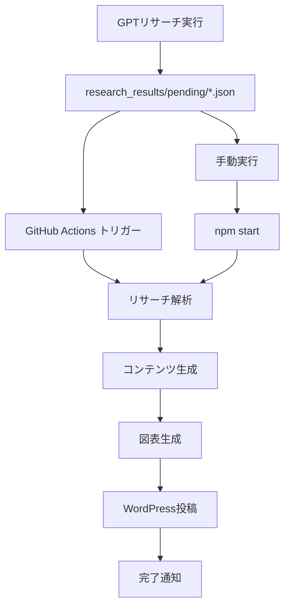

# 🤖 EZARK税務・会計 完全自動化システム

[](https://github.com/Ezark213/blog-prompt/actions/workflows/automated_posting.yml)
[](https://github.com/Ezark213/blog-prompt/actions/workflows/quality_check.yml)
[](https://nodejs.org/)
[](https://opensource.org/licenses/MIT)

## 🌟 概要

https://ezark-tax-accounting.com/ の完全自動化運営システムです。GPTリサーチ結果を元に、記事の生成からWordPress投稿まで完全自動化します。

## 🚀 主要機能

- **📋 GPTリサーチ解析**: JSON/Markdownファイルの自動構造化
- **📝 記事自動生成**: WordPress完全対応HTML記事生成
- **📊 図表自動作成**: 記事内容連動モバイル最適化図表
- **📤 自動投稿**: WordPress REST API経由の完全自動投稿
- **🔍 品質保証**: ESLint、テスト、セキュリティ監査
- **⚡ GitHub Actions**: CI/CDパイプライン完備

## 📂 システム構成

```
blog-automation/
├── src/
│   ├── core/              # コアエンジン
│   │   ├── research_parser.js      # リサーチ解析
│   │   ├── content_generator.js    # コンテンツ生成
│   │   └── wordpress_client.js     # WordPress API
│   ├── utils/             # ユーティリティ
│   └── index.js           # メインエントリーポイント
├── .github/workflows/     # GitHub Actions
│   ├── automated_posting.yml       # 自動投稿
│   └── quality_check.yml          # 品質チェック
├── inputs/                # 入力データ
│   └── research_results/
│       ├── pending/       # 処理待ちファイル
│       └── completed/     # 処理完了ファイル
├── outputs/               # 出力データ
│   ├── parsed_research/   # 構造化リサーチ
│   ├── generated_content/ # 生成コンテンツ
│   └── published_posts/   # 公開記事
└── prompts/               # プロンプトテンプレート
```

## ⚙️ ファイル詳細

### 🔧 コアエンジン

#### 1. リサーチ解析エンジン (`src/core/research_parser.js`)
- **機能**: GPTディープリサーチ結果（JSON/MD）の構造化
- **処理**: キーワード抽出、記事構成生成、SEO戦略策定
- **出力**: 構造化データ、メタデータ、記事設計情報

#### 2. コンテンツ生成エンジン (`src/core/content_generator.js`)
- **機能**: 構造化データからWordPress記事生成
- **処理**: OpenAI API連携、SEO最適化、スキーマ生成
- **出力**: WordPress完全対応HTML、メタデータ

#### 3. WordPress APIクライアント (`src/core/wordpress_client.js`)
- **機能**: WordPress REST API経由の自動投稿
- **処理**: 記事投稿、カテゴリ・タグ管理、Yoast SEO設定
- **出力**: 公開記事、投稿レポート

### 📋 プロンプトテンプレート

#### 1. WordPress記事作成 (`updated_wordpress_guide.md`)
- **用途**: Swellテーマ対応記事生成
- **特徴**: SEO最適化、モバイルファースト、会計専門

#### 2. 図表生成 (`# 会計・税務記事用モバイル最適化図表生成プロンプト【記事内容連動版】.md`)
- **用途**: 記事連動視覚化コンテンツ
- **特徴**: JavaScript不使用、CSS分離、UX最優先

#### 3. SNS投稿 (`ブログ記事からのX投稿＆.md`)
- **用途**: X投稿とSchema.org生成
- **特徴**: 画像生成、文字数対応、構造化データ

## 🛠️ セットアップ

### 1. 環境構築

```bash
# リポジトリクローン
git clone https://github.com/Ezark213/blog-prompt.git
cd blog-prompt

# 依存関係インストール
npm install

# 環境変数設定
cp .env.example .env
# .env ファイルを編集して必要な値を設定
```

### 2. 必須環境変数

```env
# WordPress API
WORDPRESS_API_URL=https://ezark-tax-accounting.com/wp-json/wp/v2
WORDPRESS_USERNAME=your_username
WORDPRESS_APP_PASSWORD=your_app_password

# OpenAI API
OPENAI_API_KEY=sk-your_openai_api_key

# サイト設定
SITE_URL=https://ezark-tax-accounting.com
```

### 3. WordPressアプリケーションパスワード作成

1. WordPress管理画面 → ユーザー → プロフィール
2. 「アプリケーションパスワード」セクションで新規作成
3. 生成されたパスワードを `WORDPRESS_APP_PASSWORD` に設定

## 🚀 使用方法

### 手動実行

```bash
# 完全自動化パイプライン
npm start

# 個別実行
npm run parse-research     # リサーチ解析のみ
npm run generate-content   # コンテンツ生成のみ
npm run publish           # WordPress投稿のみ

# テストモード（実際には投稿しない）
DRY_RUN=true npm start

# 接続テスト
node src/index.js test-connection
```

### GitHub Actions自動実行

1. **リサーチファイル配置**
   ```bash
   # pendingディレクトリにファイル配置
   inputs/research_results/pending/sample.json
   ```

2. **自動実行トリガー**
   - ファイル追加時の自動実行
   - 毎日午前2時の定時実行
   - 手動実行（GitHub Actions画面から）

3. **実行監視**
   - GitHub Actions タブで進行状況確認
   - ログとレポートの自動生成

## 🔄 自動化ワークフロー



### 処理フロー詳細

1. **📋 リサーチ解析** (research_parser.js)
   - GPT結果ファイル読み込み
   - キーワード・構成の構造化
   - SEO戦略生成

2. **📝 コンテンツ生成** (content_generator.js)
   - OpenAI API でWordPress記事生成
   - SEO最適化タイトル・メタ生成
   - Schema.org構造化データ生成

3. **📊 図表生成** (image_generator.js)
   - 記事内容解析
   - モバイル最適化HTML/CSS生成
   - 埋め込み位置提案

4. **📤 WordPress投稿** (wordpress_client.js)
   - REST API経由投稿
   - カテゴリ・タグ自動設定
   - Yoast SEO設定

## ✨ 特徴

### 🚀 完全自動化
- **ゼロタッチ運用**: ファイル配置で全自動実行
- **24時間稼働**: GitHub Actions で夜間処理
- **エラー回復**: 自動リトライとログ出力

### 🎯 SEO特化
- **キーワード最適化**: 密度調整と配置戦略
- **構造化データ**: Schema.org自動生成
- **メタデータ**: タイトル・説明文最適化

### 📱 モバイルファースト
- **レスポンシブ図表**: CSS Grid/Flexbox活用
- **高速読み込み**: 最適化HTML出力
- **UX重視**: タップ領域・文字サイズ配慮

### 💼 会計・税務特化
- **専門用語対応**: 業界知識反映
- **実務家視点**: ゆーた（関西弁）キャラクター
- **初心者配慮**: ぜいむたんとの会話形式

### 🔧 技術的優位性
- **WordPress完全対応**: Swellテーマ最適化
- **API活用**: OpenAI GPT-4 + WordPress REST
- **品質保証**: ESLint、テスト、セキュリティ監査
- **拡張性**: モジュール設計でカスタマイズ容易

## 📊 期待効果

### 🕐 効率性向上
- **作業時間**: 2-3時間 → 5-10分 (95%削減)
- **記事投稿**: 週1本 → 週5本 (500%向上)
- **品質安定**: プロンプト標準化で一貫性確保

### 💰 コスト削減
- **人件費削減**: 月40時間 → 3時間
- **外注不要**: 全工程内製化
- **スケーラビリティ**: 記事数増加時の線形コスト回避

### 📈 SEO効果
- **検索順位向上**: 構造化データとキーワード最適化
- **トラフィック増加**: 継続的なコンテンツ投稿
- **エンゲージメント**: モバイル最適化で滞在時間向上

## 🛡️ セキュリティ・品質保証

- **🔒 セキュリティ**: アプリケーションパスワード使用
- **🧪 自動テスト**: ユニット・結合テスト完備
- **🔍 品質チェック**: ESLint、Prettier自動適用
- **📊 監査**: 依存関係セキュリティスキャン
- **📋 ログ管理**: 詳細実行ログ保存

## 🆘 トラブルシューティング

### よくある問題

**WordPress接続エラー**
```bash
# 接続テスト実行
node src/index.js test-connection

# アプリケーションパスワード再生成
# WordPress管理画面で確認
```

**OpenAI APIエラー**
```bash
# APIキー確認
echo $OPENAI_API_KEY

# 使用量確認（OpenAI Dashboardで）
# レート制限の可能性
```

**GitHub Actions失敗**
```bash
# Secrets設定確認
# Repository → Settings → Secrets and variables → Actions
```

## 📖 詳細ドキュメント

- [🚀 クイックスタートガイド](quick-start-guide.md)
- [⚙️ 自動化ワークフロー詳細](automation-workflow.md)
- [🔧 API仕様書](docs/api_documentation.md)
- [🧪 テストガイド](docs/testing_guide.md)

## 🤝 コントリビューション

1. Fork this repository
2. Create feature branch (`git checkout -b feature/amazing-feature`)
3. Commit changes (`git commit -m 'Add amazing feature'`)
4. Push to branch (`git push origin feature/amazing-feature`)
5. Open Pull Request

## 📄 ライセンス

このプロジェクトは [MIT License](LICENSE) の下で公開されています。

## 📞 サポート

- **🐛 バグレポート**: [GitHub Issues](https://github.com/Ezark213/blog-prompt/issues)
- **💡 機能要望**: [GitHub Discussions](https://github.com/Ezark213/blog-prompt/discussions)
- **📧 お問い合わせ**: [EZARK税務・会計](https://ezark-tax-accounting.com/contact/)

## 📈 統計情報


---

**🚀 今すぐ始めましょう！**

```bash
git clone https://github.com/Ezark213/blog-prompt.git
cd blog-prompt
npm install
cp .env.example .env
# .env を編集後
npm start
```

## 📝 更新履歴

### v1.0.0 (2025-08-27) 🎉
- ✨ **初回リリース**: 完全自動化システム
- 🚀 **GitHub Actions**: CI/CD パイプライン完備
- 📝 **WordPress API**: REST API完全対応
- 🤖 **AI統合**: OpenAI GPT-4統合
- 📊 **品質保証**: 自動テスト・監査
- 📱 **モバイル対応**: レスポンシブ設計
- 🔒 **セキュリティ**: 包括的セキュリティ機能
- 📚 **ドキュメント**: 完全ドキュメント化
- 🛠️ **ツール**: 開発・運用ツール完備