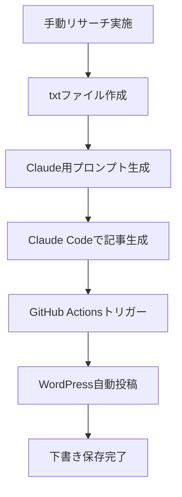

# WordPress自動投稿セットアップガイド

## 🚀 概要

GitHub Actionsを使用してClaude Codeで生成した記事を自動的にWordPressの下書きとして保存できるシステムです。

## 📋 必要な準備

### 1. WordPressアプリケーションパスワード設定

1. WordPressダッシュボードにログイン
2. **ユーザー** > **プロフィール** に移動
3. **アプリケーションパスワード** セクションで新しいパスワードを作成
4. 生成されたパスワードをメモ（例: `Nt23 Ignl gD5m 0tul 7i62 VEZQ`）

### 2. GitHub Secretsの設定

1. GitHubリポジトリページにアクセス
2. **Settings** > **Secrets and variables** > **Actions** をクリック
3. 以下のSecretsを追加：

```
WORDPRESS_API_URL: https://ezark-tax-accounting.com/wp-json/wp/v2
WORDPRESS_USERNAME: your_wordpress_username
WORDPRESS_APP_PASSWORD: Nt23 Ignl gD5m 0tul 7i62 VEZQ
```

## 🔧 使用方法

### 方法1: ローカルからWordPress投稿

```bash
# 1. 環境変数を設定
cp .env.example .env
# .envファイルを編集してWordPress情報を入力

# 2. 記事生成
npm run claude your_research.txt

# 3. WordPress投稿
node src/wordpress_auto_post.js
```

### 方法2: GitHub Actionsで自動投稿

1. **GitHub Actions** タブに移動
2. **WordPress Auto Post** ワークフローを選択
3. **Run workflow** をクリック
4. リサーチファイル名を入力（例: `sample_research.txt`）
5. **Run workflow** で実行

### 方法3: ファイル変更での自動トリガー

1. `outputs/claude_articles/` または `outputs/generated_articles/` にJSONファイルを追加
2. GitHubにプッシュすると自動的にWordPress投稿が実行されます

## 🛡️ セキュリティ対策

- ✅ パスワードはGitHub Secretsに暗号化保存
- ✅ アプリケーションパスワードを使用（WordPressログインパスワードではない）
- ✅ 記事は下書きとして保存（誤公開防止）
- ✅ API呼び出し制限対策済み

## 🔍 トラブルシューティング

### WordPress接続エラー

```bash
❌ WordPress接続エラー: Request failed with status code 401
```

**解決方法**:
1. WordPressユーザー名が正しいか確認
2. アプリケーションパスワードが正しいか確認
3. WordPress REST APIが有効か確認

### 記事が見つからないエラー

```bash
❌ 投稿する記事が見つかりません
```

**解決方法**:
1. `outputs/claude_articles/` ディレクトリにJSONファイルがあるか確認
2. ファイルの形式が正しいか確認

### GitHub Actions実行エラー

**解決方法**:
1. GitHub Secretsが正しく設定されているか確認
2. リポジトリのActions権限が有効か確認

## 📊 実行結果の確認

成功時の出力例:
```
✅ 投稿完了！
============================================================
📝 タイトル: freee会計ソフト完全ガイド
🆔 WordPress ID: 123
🔗 下書きURL: https://ezark-tax-accounting.com/?p=123&preview=true
📅 保存日時: 2025-09-03T10:30:00.000Z
============================================================
```

## 🎯 ワークフロー全体



## 🔗 関連ファイル

- `src/wordpress_auto_post.js` - 自動投稿メインスクリプト
- `src/core/wordpress_client.js` - WordPress API クライアント
- `.github/workflows/wordpress-auto-post.yml` - GitHub Actions設定
- `.env.example` - 環境変数サンプル

## 📞 サポート

問題が発生した場合は、GitHubのIssuesでお知らせください。

---

**⚠️ 注意**: パスワードは絶対にコードにハードコーディングせず、GitHub Secretsまたは環境変数を使用してください。