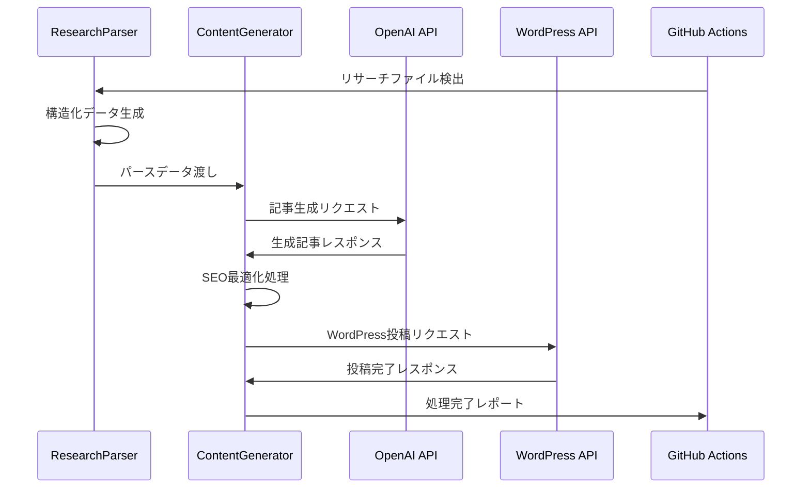

# 🔧 API仕様書

EZARK税務・会計ブログ自動化システム - API詳細仕様

## 📋 概要

本システムは以下のAPIを活用して完全自動化を実現します：

- **OpenAI API**: コンテンツ生成
- **WordPress REST API**: 記事投稿・管理
- **GitHub API**: リポジトリ管理（間接的）

## 🤖 OpenAI API 仕様

### 基本設定

```javascript
const openai = new OpenAI({
  apiKey: process.env.OPENAI_API_KEY
});
```

### 使用モデル
- **メインモデル**: `gpt-4`
- **補助モデル**: `gpt-3.5-turbo`（軽量処理用）

### API使用パターン

#### 1. 記事コンテンツ生成

```javascript
const response = await openai.chat.completions.create({
  model: "gpt-4",
  messages: [
    {
      role: "system", 
      content: wordpressPrompt  // WordPress記事生成プロンプト
    },
    {
      role: "user",
      content: researchDataPrompt  // リサーチデータ
    }
  ],
  max_tokens: 8000,
  temperature: 0.7
});
```

**パラメータ説明**:
- `max_tokens`: 8000（記事長最大）
- `temperature`: 0.7（創造性とファクト性のバランス）

#### 2. SEO最適化処理

```javascript
const response = await openai.chat.completions.create({
  model: "gpt-3.5-turbo",
  messages: [{ role: "user", content: seoPrompt }],
  max_tokens: 150,
  temperature: 0.3  // より保守的な出力
});
```

### レート制限対応

```javascript
class OpenAIClient {
  constructor() {
    this.requestDelay = parseInt(process.env.API_DELAY) || 2000;
    this.maxRetries = parseInt(process.env.MAX_RETRIES) || 3;
  }

  async makeRequest(params) {
    let attempt = 0;
    while (attempt < this.maxRetries) {
      try {
        const response = await this.openai.chat.completions.create(params);
        return response;
      } catch (error) {
        if (error.response?.status === 429) {
          // レート制限エラー
          await this.delay(this.requestDelay * (attempt + 1));
          attempt++;
        } else {
          throw error;
        }
      }
    }
    throw new Error('Max retries exceeded');
  }
}
```

## 📤 WordPress REST API 仕様

### 認証設定

```javascript
const authHeader = {
  'Authorization': `Basic ${Buffer.from(`${username}:${appPassword}`).toString('base64')}`,
  'Content-Type': 'application/json'
};
```

**推奨**: アプリケーションパスワード使用

### エンドポイント一覧

#### 1. 記事投稿

**POST** `/wp-json/wp/v2/posts`

```javascript
const postData = {
  title: "記事タイトル",
  content: "記事本文（HTML）",
  slug: "article-slug",
  status: "publish",  // or "draft"
  categories: [1, 2],  // カテゴリID配列
  tags: [3, 4, 5],     // タグID配列
  author: 1,           // 著者ID
  excerpt: "メタディスクリプション",
  meta: {
    _yoast_wpseo_metadesc: "SEOメタディスクリプション",
    _yoast_wpseo_focuskw: "フォーカスキーワード"
  }
};
```

**レスポンス**:
```json
{
  "id": 123,
  "date": "2025-08-27T12:00:00",
  "link": "https://ezark-tax-accounting.com/article-slug/",
  "title": {"rendered": "記事タイトル"},
  "status": "publish"
}
```

#### 2. カテゴリ管理

**GET** `/wp-json/wp/v2/categories?search=カテゴリ名`
**POST** `/wp-json/wp/v2/categories`

```javascript
const categoryData = {
  name: "カテゴリ名",
  slug: "category-slug",
  description: "カテゴリ説明"
};
```

#### 3. タグ管理

**GET** `/wp-json/wp/v2/tags?search=タグ名`
**POST** `/wp-json/wp/v2/tags`

```javascript
const tagData = {
  name: "タグ名",
  slug: "tag-slug"
};
```

#### 4. メタデータ設定

**POST** `/wp-json/wp/v2/posts/{id}/meta`

```javascript
const metaData = {
  meta_key: "_yoast_wpseo_title",
  meta_value: "SEOタイトル"
};
```

### エラーハンドリング

```javascript
class WordPressClient {
  async handleAPIError(error) {
    const status = error.response?.status;
    const message = error.response?.data?.message;
    
    switch (status) {
      case 401:
        throw new Error('WordPress認証エラー: 資格情報を確認してください');
      case 403:
        throw new Error('WordPressアクセス権限エラー: 権限を確認してください');
      case 404:
        throw new Error('WordPressエンドポイントが見つかりません');
      case 429:
        // レート制限
        await this.delay(5000);
        return 'retry';
      default:
        throw new Error(`WordPress API エラー: ${message || error.message}`);
    }
  }
}
```

## 🔄 システム間連携仕様

### データフロー



### データ形式

#### リサーチデータ形式

```json
{
  "title": "記事タイトル",
  "keywords": {
    "primary": "メインキーワード",
    "secondary": ["サブキーワード1", "サブキーワード2"],
    "longtail": ["ロングテールキーワード1", "ロングテールキーワード2"]
  },
  "structure": {
    "introduction": "導入文",
    "sections": [
      {
        "title": "セクションタイトル",
        "order": 1,
        "estimatedLength": "500-800",
        "includeChart": true
      }
    ],
    "conclusion": "まとめ"
  },
  "metaData": {
    "slug": "article-slug",
    "categories": ["税務・会計"],
    "tags": ["freee", "確定申告"],
    "focusKeyword": "メインキーワード"
  }
}
```

#### 生成記事データ形式

```json
{
  "sourceFile": "research_file.json",
  "title": "最適化タイトル",
  "content": "WordPress HTML記事本文",
  "metaDescription": "SEO最適化メタディスクリプション", 
  "slug": "optimized-slug",
  "categories": ["税務・会計", "クラウド会計"],
  "tags": ["freee", "マネーフォワード", "確定申告"],
  "focusKeyword": "メインキーワード",
  "schema": "JSON-LD形式構造化データ",
  "wordCount": 3500,
  "estimatedReadTime": 8,
  "generatedAt": "2025-08-27T12:00:00Z"
}
```

## ⚙️ 設定・環境変数

### 必須設定

```env
# OpenAI API
OPENAI_API_KEY=sk-your_openai_api_key
OPENAI_MODEL=gpt-4
OPENAI_DAILY_LIMIT=100

# WordPress API  
WORDPRESS_API_URL=https://ezark-tax-accounting.com/wp-json/wp/v2
WORDPRESS_USERNAME=your_username
WORDPRESS_APP_PASSWORD=your_app_password

# システム設定
API_DELAY=2000          # API呼び出し間隔（ms）
MAX_RETRIES=3          # リトライ回数
PROCESSING_TIMEOUT=300  # タイムアウト（秒）
```

### API制限設定

```env
# 使用量制限
OPENAI_DAILY_LIMIT=100           # 1日あたりのOpenAI API呼び出し
WORDPRESS_HOURLY_LIMIT=50        # 1時間あたりのWordPress API呼び出し

# レート制限対応
API_DELAY=2000                   # 呼び出し間隔（ミリ秒）
RETRY_DELAY=5000                 # リトライ間隔（ミリ秒）
MAX_RETRIES=3                    # 最大リトライ回数
```

## 📊 ログ・監視

### ログ形式

```json
{
  "timestamp": "2025-08-27T12:00:00Z",
  "level": "info",
  "component": "ContentGenerator",
  "action": "generate_article", 
  "details": {
    "sourceFile": "research.json",
    "title": "記事タイトル",
    "wordCount": 3500,
    "processingTime": 45.2
  },
  "apiUsage": {
    "openai_tokens": 7500,
    "wordpress_calls": 3
  }
}
```

### エラーログ

```json
{
  "timestamp": "2025-08-27T12:05:00Z",
  "level": "error",
  "component": "WordPressClient",
  "error": {
    "type": "APIError",
    "message": "WordPress connection failed",
    "stack": "Error stack trace...",
    "statusCode": 401
  },
  "context": {
    "operation": "publish_article",
    "articleId": "article_123",
    "retryAttempt": 2
  }
}
```

## 🧪 テスト仕様

### API接続テスト

```javascript
// OpenAI接続テスト
async function testOpenAIConnection() {
  try {
    const response = await openai.chat.completions.create({
      model: "gpt-3.5-turbo",
      messages: [{ role: "user", content: "Hello" }],
      max_tokens: 5
    });
    return { success: true, model: response.model };
  } catch (error) {
    return { success: false, error: error.message };
  }
}

// WordPress接続テスト  
async function testWordPressConnection() {
  try {
    const response = await axios.get(`${apiUrl}/posts`, {
      params: { per_page: 1 },
      headers: authHeader
    });
    return { success: true, postsCount: response.data.length };
  } catch (error) {
    return { success: false, error: error.message };
  }
}
```

### パフォーマンステスト

```javascript
// レスポンス時間測定
async function measureAPIPerformance() {
  const start = Date.now();
  await apiCall();
  const duration = Date.now() - start;
  
  logger.info(`API call duration: ${duration}ms`);
  
  if (duration > 30000) {  // 30秒
    logger.warn('API call exceeded expected duration');
  }
}
```

## 🔐 セキュリティ仕様

### 認証・認可

- **WordPress**: アプリケーションパスワード（推奨）
- **OpenAI**: APIキー（環境変数で管理）
- **GitHub**: Personal Access Token（Secrets管理）

### データ保護

```javascript
// 機密情報のマスキング
function sanitizeLog(data) {
  const sensitive = ['password', 'apiKey', 'token'];
  const cleaned = { ...data };
  
  sensitive.forEach(field => {
    if (cleaned[field]) {
      cleaned[field] = '***REDACTED***';
    }
  });
  
  return cleaned;
}
```

### API制限遵守

```javascript
class APIRateLimiter {
  constructor() {
    this.calls = new Map();
  }
  
  async checkLimit(apiName, limit, timeWindow) {
    const now = Date.now();
    const key = `${apiName}:${Math.floor(now / timeWindow)}`;
    
    const currentCalls = this.calls.get(key) || 0;
    if (currentCalls >= limit) {
      throw new Error(`API rate limit exceeded for ${apiName}`);
    }
    
    this.calls.set(key, currentCalls + 1);
  }
}
```

## 📈 パフォーマンス最適化

### 並列処理

```javascript
// 複数記事の並列生成（制限付き）
async function generateMultipleArticles(researchDataList) {
  const concurrency = parseInt(process.env.CONCURRENT_PROCESSES) || 2;
  const results = [];
  
  for (let i = 0; i < researchDataList.length; i += concurrency) {
    const batch = researchDataList.slice(i, i + concurrency);
    const batchResults = await Promise.all(
      batch.map(data => generateArticle(data))
    );
    results.push(...batchResults);
    
    // バッチ間の待機
    if (i + concurrency < researchDataList.length) {
      await delay(5000);
    }
  }
  
  return results;
}
```

### キャッシュ戦略

```javascript
class ResponseCache {
  constructor() {
    this.cache = new Map();
    this.ttl = parseInt(process.env.CACHE_TTL) || 3600000; // 1時間
  }
  
  set(key, value) {
    this.cache.set(key, {
      value,
      timestamp: Date.now()
    });
  }
  
  get(key) {
    const item = this.cache.get(key);
    if (!item) return null;
    
    if (Date.now() - item.timestamp > this.ttl) {
      this.cache.delete(key);
      return null;
    }
    
    return item.value;
  }
}
```

## 📋 エラーコード一覧

| コード | 説明 | 対処法 |
|--------|------|--------|
| `OPENAI_001` | OpenAI API認証エラー | APIキー確認 |
| `OPENAI_002` | OpenAIレート制限 | 待機後リトライ |
| `OPENAI_003` | OpenAIトークン上限 | リクエスト分割 |
| `WP_001` | WordPress認証エラー | 資格情報確認 |
| `WP_002` | WordPress権限エラー | ユーザー権限確認 |
| `WP_003` | WordPressエンドポイント無効 | URL確認 |
| `SYS_001` | 必須環境変数未設定 | .env設定確認 |
| `SYS_002` | ファイルI/Oエラー | パーミッション確認 |
| `SYS_003` | 処理タイムアウト | タイムアウト値調整 |

---

この仕様書は開発・運用時の技術リファレンスとして活用してください。